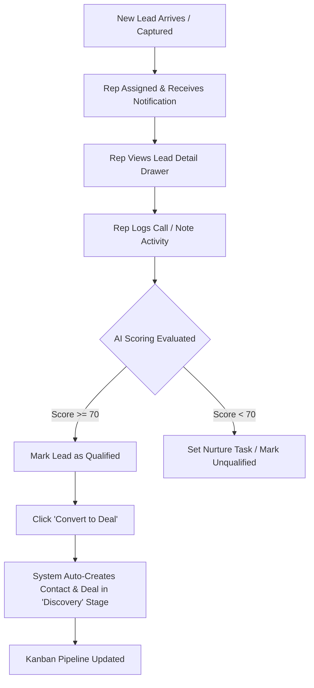
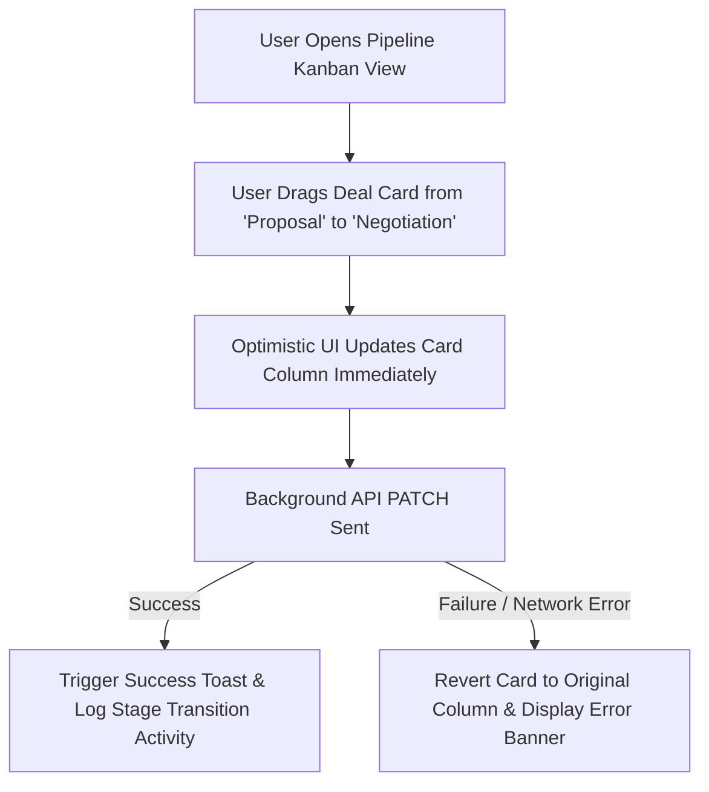

# Phase 1B: Product Structure & UX Blueprint

**Project Name:** AgencyFlow  
**Document Version:** 1.0.0  
**Status:** Approved  
**Author:** Senior UX Architect & Product Manager  

---

## 1. Information Architecture & Sitemap

```
AgencyFlow Structure
│
├── [Public Pages]
│   ├── Landing Page (Hero, Features, Social Proof, Interactive Demo Preview)
│   ├── Pricing Page (Tier Breakdown, ROI Calculator)
│   ├── Sign In / Sign Up (Workspace Registration)
│
├── [App Workspace (Authenticated)]
│   ├── Dashboard (KPI Cards, Revenue Chart, Recent Activity, Task Queue)
│   ├── Leads Management (Data Table View, Filters, Quick Add Drawer)
│   ├── Sales Pipeline (Interactive Kanban Board, Table View Toggle)
│   ├── Contacts Directory (Relational view: People & Companies)
│   ├── Deals & Accounts (Deal Detail Drawer, Stage History, File Attachments)
│   ├── Tasks & Activities (Calendar/List View, Due Alerts)
│   ├── AI Assistant Workspace (Lead Scoring Inspector, Email Draft Copilot)
│   └── Reports & Analytics (Conversion Funnels, Stage Velocity, Rep Leaderboard)
│
└── [Workspace Settings & Admin]
    ├── Team & Users (Invite Members, Assign Roles: Owner/Manager/Rep)
    ├── Organization Settings (Workspace Name, Custom Tags, Branding)
    └── Audit & Security Logs (Activity Logs, Access Controls)
```

---

## 2. Navigation Strategy

* **Main Application Sidebar (Desktop):** Collapsible vertical navigation bar featuring icons + labels (Dashboard, Leads, Pipeline, Contacts, Tasks, Analytics, AI Copilot, Settings).
* **Top Workspace Header:** Active Workspace Switcher, Global Quick Search (`Cmd+K` / `Ctrl+K`), Quick-Add Lead Button (`+ New Lead`), Notification Bell, and User Profile Dropdown.
* **Mobile Drawer Navigation:** Bottom navigation bar for core screens (Dashboard, Leads, Pipeline, Tasks, Menu) coupled with a full-screen drawer modal for secondary options.

---

## 3. User Journeys (Mermaid Flowcharts)

### Journey 1: Inbound Lead to Qualified Deal Conversion



### Journey 2: Kanban Deal Drag-and-Drop Stage Transition



---

## 4. UI State Inventory (Comprehensive System States)

Every screen in AgencyFlow is explicitly designed to handle eight standardized UI states:

| UI State | Visual Representation & UX Pattern |
| :--- | :--- |
| **1. Loading** | Subtle pulsing skeleton screens matching exact component layout dimensions (prevents layout shift). |
| **2. Skeleton** | Grey animated placeholders for table rows, stats cards, and lead drawer forms. |
| **3. Empty** | Friendly SVG illustration, contextual text (e.g., *"No active deals in Negotiation"*), and a high-contrast Primary CTA button (*"+ Create Deal"*). |
| **4. Error** | Clear error toast / alert card detailing the issue with a direct *"Retry Connection"* or *"Refresh"* action button. |
| **5. Success** | Smooth checkmark micro-animation and non-intrusive auto-dismissing toast notification. |
| **6. Permission Denied** | Shield icon, informative text (*"Admin access required for user management"*), and a *"Return to Dashboard"* link. |
| **7. Offline** | Top persistent warning banner (*"Working Offline — Changes will sync when reconnected"*). |
| **8. No Results** | Filter empty state (*"No leads match search 'Acme' — Clear Filters"* button). |

---

## 5. Screen Content Strategy & Quick-Action Drawers

### Screen: Leads Table & Drawer View
* **Primary CTA:** `+ Add New Lead` (Opens Slide-over Drawer).
* **Secondary CTAs:** Bulk Assign, Export CSV, Filter by Lead Score / Status.
* **Key Components:**
  * Interactive filter bar (Status, Source, Assignee, Score range).
  * Data Table with hover rows and inline status badge dropdowns.
  * Slide-over Detail Drawer containing: Lead Metadata, AI Score Widget, Activity Timeline, and Quick Note Form.

### Screen: Sales Pipeline Kanban
* **Primary CTA:** `+ New Deal`.
* **Secondary CTAs:** View Toggle (Kanban Board vs. Compact Table), Stage Filter.
* **Key Components:**
  * Column headers with Deal Count badge and aggregated Monetary Value (`$ formatted`).
  * Drag-and-drop Deal Cards showcasing Company Name, Deal Title, Amount, Assigned Rep Avatar, and Days-in-Stage indicator.

---

## 6. UX Polish & Micro-Interactions

1. **Keyboard Shortcuts:** `Cmd+K` for global search, `N` for new lead, `Esc` to close slide-over drawers.
2. **Optimistic Feedback:** Dragging deals or completing tasks updates the UI instantly, providing instant responsiveness while synchronizing with the backend.
3. **Stage Aging Indicators:** Deal cards sitting in a stage past the threshold (e.g., >14 days in Proposal) display a subtle warning pill (*"Stale: 16d"*).
